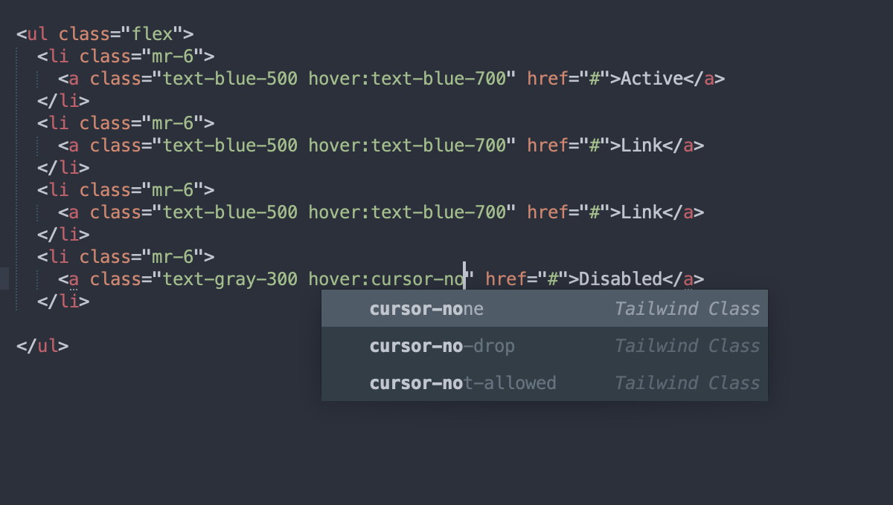

Tailwind CSS Autocomplete for Sublime Text 3
=============

Tailwind CSS Autocomplete plugin for [Tailwind CSS](https://tailwindcss.com/) (v1.4.6).

You may want to remove the `:` character in your `word_separators` setting in your user **Preference.sublime-settings** file. This will prevent autocomplete from breaking on breakpoint and pseudo classes used within Tailwind.

    // Characters that are considered to separate words
    "word_separators": "./\\()\"'-:,.;<>~!@#$%^&*|+=[]{}`~?",

### Credits
Forked from [Tachyons Autocomplete for Sublime Text 3](https://github.com/webchun/tachyons-sublime-autocomplete) by [@webchun](https://github.com/webchun)

Created based on [UIKit Plugin](https://github.com/uikit/uikit-sublime)
